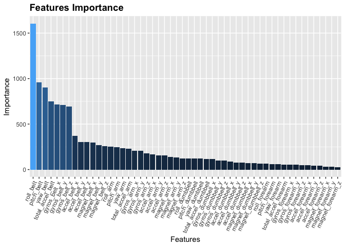

####Background:

Using devices such as Jawbone Up, Nike FuelBand, and Fitbit it is now possible to collect a large amount of data about personal activity relatively inexpensively. These type of devices are part of the quantified self movement – a group of enthusiasts who take measurements about themselves. In this project, my goal will be to use data from accelerometers on the belt, forearm, arm, and dumbell of 6 participants. They were asked to perform barbell lifts correctly and incorrectly in 5 different ways. More information is available from the website here: http://groupware.les.inf.puc-rio.br/har (see the section on the Weight Lifting Exercise Dataset). 

####Task:

The focus of this task is to use machine learning to predict which one of the 5 ways (the classe variable in the dataset) the barbell lift falls under. This would help to find the best ways to lift barbells. For this task we are going to use the training and test dataset provided in the assignment.

---
###Setup

We need to load the libraries and download the datasets. By exploring the dataset is possible to see that there are some values like "#DIV/0!" that need to be converted to NA while loading the dataset.

As the process can take quite sometime, We are goint to use the 6 cores of the machine


```r
library(caret)
#library(doMC)
#registerDoMC(cores = 6)
set.seed(107484)

#Download data
Train <- read.csv("https://d396qusza40orc.cloudfront.net/predmachlearn/pml-training.csv", na.strings=c("#DIV/0!"), row.names = 1)
Test <- read.csv("https://d396qusza40orc.cloudfront.net/predmachlearn/pml-testing.csv", na.strings=c("#DIV/0!"), row.names = 1)
```

---

####Data Exploration

Continuing the Data exploration, we can see that there are many variables that cannot be used, some are redundand and some have null values, we are going to clear some of the NA colums, in this case about 75%. The num_window variable and classe have seems to have a correlation. 

---

####Pre Processing

First and very important is to partition the data 80% Training and 20% Validation, why at the beginning? Because this can help us to reduce the ammount of data and can prevent memory overfloating while running any algorithm.


```r
library(caret)
#Creating partitions first to reduce the amount of data

trainset <- createDataPartition(Train$classe, p=0.8, list=FALSE)
Training <- Train[trainset,]
Validation <- Train[-trainset,]
```

Then we are going to use caret function nearZeroVar to remove all the columns where values are almost 0. After that we need to find the size of all the non numbers or empty values and create a filter, in this case 75% is a good amount to keep for our sample.

Once the filter provide us with the null.cols, we need to exclude all the description columns.


```r
Training <- Training[,-nearZeroVar(Training)]
filter.size.NA.empty <- sapply(Training, function(x) {
     sum(!(is.na(x) | x == ""))
})

null.cols <- names(filter.size.NA.empty[filter.size.NA.empty < 0.75 * length(Training$classe)])
description.cols <- c("X", "user_name", "raw_timestamp_part_1", "raw_timestamp_part_2", 
                     "cvtd_timestamp", "new_window", "num_window")
exclude.cols <- c(description.cols, null.cols)

Training <- Training[, !names(Training) %in% exclude.cols]
```

## Model training

###Random Forest


```r
rf.Model <- train(classe ~ ., Training, method= 'rf', trainControl=trainControl(method='cv',number=10), preprocess=c('center','scale'))
```


For this particular exercise we are going to use random forest, the decision was made based on the high accuracy that this algorithm presents when there are no many records in our sample. We can leave the machine doing 10 cross validations and preprocess using center and scale for determine how are we are going to substract the average and divide by the standard deviation.


Time to check our accuracy


```r
#Training set accuracy
predict.training <- predict(rf.Model, Training)
print(confusionMatrix(predict.training, Training$classe))
```

```
## Confusion Matrix and Statistics
## 
##           Reference
## Prediction    A    B    C    D    E
##          A 4464    0    0    0    0
##          B    0 3038    0    0    0
##          C    0    0 2738    0    0
##          D    0    0    0 2573    0
##          E    0    0    0    0 2886
## 
## Overall Statistics
##                                      
##                Accuracy : 1          
##                  95% CI : (0.9998, 1)
##     No Information Rate : 0.2843     
##     P-Value [Acc > NIR] : < 2.2e-16  
##                                      
##                   Kappa : 1          
##  Mcnemar's Test P-Value : NA         
## 
## Statistics by Class:
## 
##                      Class: A Class: B Class: C Class: D Class: E
## Sensitivity            1.0000   1.0000   1.0000   1.0000   1.0000
## Specificity            1.0000   1.0000   1.0000   1.0000   1.0000
## Pos Pred Value         1.0000   1.0000   1.0000   1.0000   1.0000
## Neg Pred Value         1.0000   1.0000   1.0000   1.0000   1.0000
## Prevalence             0.2843   0.1935   0.1744   0.1639   0.1838
## Detection Rate         0.2843   0.1935   0.1744   0.1639   0.1838
## Detection Prevalence   0.2843   0.1935   0.1744   0.1639   0.1838
## Balanced Accuracy      1.0000   1.0000   1.0000   1.0000   1.0000
```

#Validation set accuracy (Our-of-Sample)

```r
predict.validation <- predict(rf.Model, Validation)
print(confusionMatrix(predict.validation, Validation$classe))
```

```
## Confusion Matrix and Statistics
## 
##           Reference
## Prediction    A    B    C    D    E
##          A 1114    6    0    0    0
##          B    1  752    4    1    0
##          C    1    1  678    6    2
##          D    0    0    2  635    1
##          E    0    0    0    1  718
## 
## Overall Statistics
##                                           
##                Accuracy : 0.9934          
##                  95% CI : (0.9903, 0.9957)
##     No Information Rate : 0.2845          
##     P-Value [Acc > NIR] : < 2.2e-16       
##                                           
##                   Kappa : 0.9916          
##  Mcnemar's Test P-Value : NA              
## 
## Statistics by Class:
## 
##                      Class: A Class: B Class: C Class: D Class: E
## Sensitivity            0.9982   0.9908   0.9912   0.9876   0.9958
## Specificity            0.9979   0.9981   0.9969   0.9991   0.9997
## Pos Pred Value         0.9946   0.9921   0.9855   0.9953   0.9986
## Neg Pred Value         0.9993   0.9978   0.9981   0.9976   0.9991
## Prevalence             0.2845   0.1935   0.1744   0.1639   0.1838
## Detection Rate         0.2840   0.1917   0.1728   0.1619   0.1830
## Detection Prevalence   0.2855   0.1932   0.1754   0.1626   0.1833
## Balanced Accuracy      0.9980   0.9944   0.9941   0.9933   0.9978
```

# Test prediction

```r
predict.test <- predict(rf.Model, Test)
predict.test
```

```
##  [1] B A B A A E D B A A B C B A E E A B B B
## Levels: A B C D E
```

# Feature Importance


```r
library(plyr)
imp.vars <- varImp(rf.Model$finalModel)
var.names <- rownames(imp.vars)
var.orders <- data.frame(varnames=var.names,imp.vars)
var.orders <- arrange(var.orders, desc(Overall))

ggplot(var.orders, aes(x=reorder(var.names,desc(Overall)),y=Overall, fill=Overall)) + 
    geom_bar(stat="identity") + theme(legend.position="none")+
    xlab("Features") + guides(fill=FALSE)+
    ylab("Importance") + ggtitle("Features Importance")+
    theme(axis.text.x=element_text(angle=65,hjust=1)) + 
    theme(plot.title = element_text(size=14, face="bold")) 
```

<!-- -->

##Model Selection

Random forest has a very high and accurary, this is because it iterates multiple times and navigates over diferent branches for finding the best value. PCA in this occasion was not as good, there are multiple factors than can affect PCA algorithms in this case it was the ammount of columns that we have choosen.


###Model Evaluation
My model against the validation set has a 100% accuracy. 

These are the final values for all the model's result on cross validation:


```r
rf.Model$finalModel
```

```
## 
## Call:
##  randomForest(x = x, y = y, mtry = param$mtry, trainControl = ..1,      preprocess = ..2) 
##                Type of random forest: classification
##                      Number of trees: 500
## No. of variables tried at each split: 27
## 
##         OOB estimate of  error rate: 0.55%
## Confusion matrix:
##      A    B    C    D    E  class.error
## A 4462    1    0    0    1 0.0004480287
## B   24 3009    5    0    0 0.0095457538
## C    0   13 2716    9    0 0.0080350621
## D    0    0   19 2551    3 0.0085503304
## E    0    1    5    5 2875 0.0038115038
```

```r
rf.Model$bestTune
```

```
##   mtry
## 2   27
```

```r
rf.Model$results
```

```
##   mtry  Accuracy     Kappa  AccuracySD     KappaSD
## 1    2 0.9903831 0.9878373 0.001931171 0.002444455
## 2   27 0.9903891 0.9878455 0.001674889 0.002118303
## 3   52 0.9822944 0.9776077 0.004586401 0.005799765
```

###Conclusion
Based on our results we can conclude the following:

- Is important to do a good cleanup to remove all the NA and Zero Variable columns
- Partition at the beginning allow us to improve the performance on our training, however most of the time the filters have to be done first.
- Random Forest is great for working with datasets with large volume of variables, however my laptop got super warm and it was almost a cooking pan, but at the end it exceeds my expectations.
- And for the result the feauture variable that give us the most relevant data was the Roll_belt 


